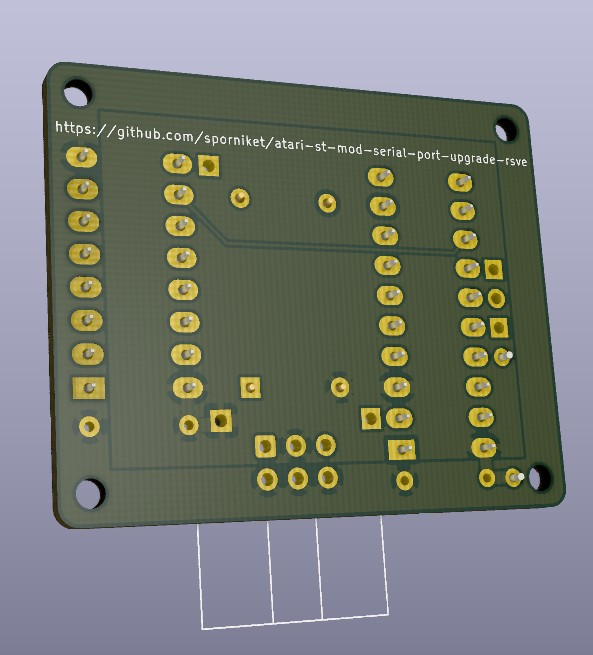

# The RSVE serial port mod for the Atari ST

> [WARNING] Please read carefully this note before using this project. It contains important facts.

Content

1. What is **The RSVE serial port mod for the Atari ST**, and when to use it ?
2. What should you know before using **The RSVE serial port mod for the Atari ST** ?
3. How to use **The RSVE serial port mod for the Atari ST** ?
4. Known issues
5. Miscellanous

## 1. What is **The RSVE serial port mod for the Atari ST**, and when to use it ?

**The RSVE serial port mod for the Atari ST** is a remake of the 'RSVE' serial port upgrade for the Atari ST, that allows to use far higher speed than the stock 19.2 kbps of an unmodded computer.

This project started from [this thread at exxosforum](https://exxosforum.co.uk/forum/viewtopic.php?f=29&t=5926) and the latest pages details what has been attempted to make it work with BBS Express (tldr : at the time of writing, it works at 38kbps, but then incoming calls at slower speed does not works).

### Licence

**The RSVE serial port mod for the Atari ST** is published under the Creative Commons CC0 license. You can find a copy of the licence there : https://creativecommons.org/publicdomain/zero/1.0/legalcode

You can copy, modify, distribute and perform the work, even for commercial purposes, all without asking permission.

**The RSVE serial port mod for the Atari ST** is distributed in the hope that it will be useful, but WITHOUT ANY WARRANTY; without even the implied warranty of MERCHANTABILITY or FITNESS FOR A PARTICULAR PURPOSE.

### Release notes

> No releases yet

## 2. What should you know before using **The RSVE serial port mod for the Atari ST** ?

**The RSVE serial port mod for the Atari ST** is made using Kicad 5.

> Do not use **The RSVE serial port mod for the Atari ST** if this project is not suitable for your project.

## 3. How to use **The RSVE serial port mod for the Atari ST** ?

### From sources

To get the latest available work, one must clone the git repository.

	git clone https://github.com/sporniket/atari-st-mod-serial-port-upgrade-rsve.git

Then, open the project with Kicad 5

## 4. Known issues
See the [project issues](https://github.com/sporniket/atari-st-mod-serial-port-upgrade-rsve/issues) page.

## 5. Miscellanous

### The original description of the mod

See the content of [`reference/rsve`](./reference/rsve) folder.

### Report issues
Use the [project issues](https://github.com/sporniket/atari-st-mod-serial-port-upgrade-rsve/issues) page.
